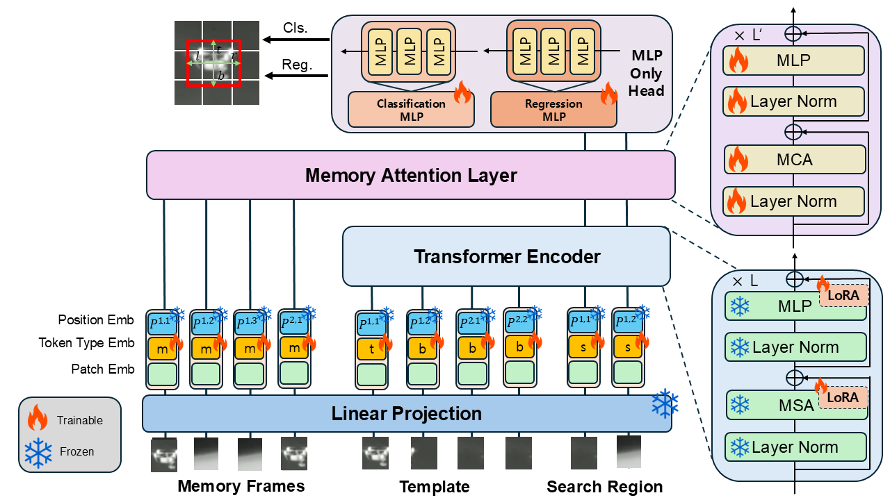
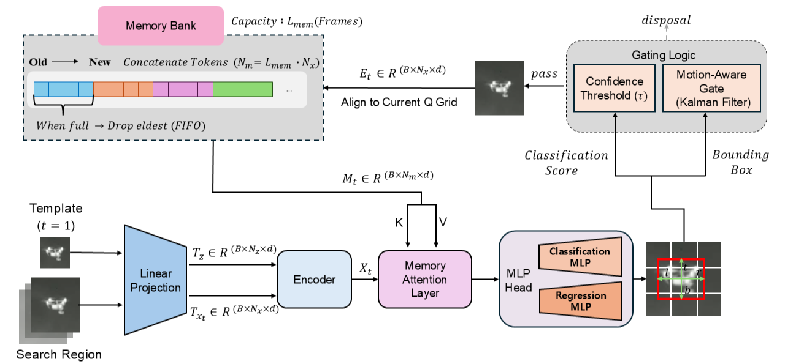

# MemLoTrack

This repository provides the official implementation of **MemLoTrack**, a memory-augmented LoRA-based tracker.

- **Based on** the LoRAT codebase: https://github.com/LitingLin/LoRAT  
We sincerely thank the LoRAT authors for making their excellent codebase publicly available.

- **Paper**: *MemLoTrack* (MDPI Sensors): https://www.mdpi.com/1424-8220/25/23/7359





# Model weight  
 : https://drive.google.com/drive/folders/1cr2yX1UagM48qIuWzvYUSfl2V1CUZuAK?usp=sharing

- `antiuav410_retrained_weight.bin` : We first pretrained the tracker on standard SOT benchmark datasets (e.g., LaSOT, TrackingNet, COCO 2017), and then fine-tuned it on Anti-UAV410.

- `antiuav410_scratch_weight.bin` : Model trained from scratch on the Anti-UAV410 dataset

# Prerequisites
### Environment
Assuming you are working on a python environment with pip installed.
We recommend running this in a virtual environment.

#### system packages (ubuntu)
```shell
apt update
apt install -y libturbojpeg
```
#### install pytorch
 PyTorch version should be >= 2.0.
```shell
pip install torch torchvision
```
#### extra python packages
```shell
pip install -r requirements.txt
```

### Dataset
#### Download
- **Anti-UAV410** (project page): https://github.com/HwangBo94/Anti-UAV410  
- **Anti-UAV410** (download link): https://drive.google.com/file/d/1zsdazmKS3mHaEZWS2BnqbYHPEcIaH5WR/view

The organized directory should look like as follow : 
```
--AntiUAV410/
	|--test
	|--train
	|--val
```


#### Prepare ```consts.yaml```
Copy ```consts.template.yaml``` as ```consts.yaml``` and fill in the path.

```yaml
Anti_UAV_410_PATH: '/path/to/antiuav410'
```

#### Login to wandb (optional)
Register an account at [wandb](https://wandb.ai/), then login with the command:
```shell
wandb login
```


## Training & Evaluation 

Note: Our code performs evaluation automatically when model training is completed.

- **Model weight** is saved in ```/path/to/output/run_id/checkpoint/epoch_{last}/model.safetensors```.
- **Performance metrics** can be found on terminal output and wandb dashboard.
- **Tracking results** are saved in ```/path/to/output/run_id/eval/epoch_{last}/```.

### Hyperparameter Configuration

To modify training configurations such as total epochs and other detailed hyperparameters, please edit the following file: `config/MemLoTrack/run.yaml`

### Using run.sh helper script (Linux with NVIDIA GPU only)

The following command executes training and evaluation for the datasets defined in `config/_dataset/train.yaml` and `config/_dataset/test.yaml`.

```shell
# Train and evaluate MemLoTrack model on all GPUs
./run.sh MemLoTrack dinov2 --output_dir /path/to/output
```

# Train and evaluate on specific GPUs
```shell
./run.sh MemLoTrack dinov2 --output_dir /path/to/output --device_ids 0,1,2,3
```
You can set the default settings, e.g. `output_dir`, in ```run.sh```.

# Specific Dataset Instructions (Anti-UAV 410)
To train or evaluate specifically on the Anti-UAV 410 Dataset, use the following --mixin flags:

- For Train & Evaluation: Add `--mixin anti_uav_train --mixin anti_uav_test`

- For Evaluation Only: Add `--mixin anti_uav_test --mixin evaluation`
```shell
# Train and evaluate MemLoTrack model on all GPUs
./run.sh MemLoTrack dinov2 --mixin anti_uav_train --mixin anti_uav_test --output_dir /path/to/output
```

```shell
# Only evaluate MemLoTrack model on all GPUs
./run.sh MemLoTrack dinov2 --mixin anti_uav_test --mixin evaluation --output_dir /path/to/output --weight_path /path/to/weight
```


Note: If you encounter any issues with torch.compile, disable is with ```--mixin disable_torch_compile```.

Note: You can disable wandb logging with ```--disable_wandb```.

### Evaluation (Success Rate, Precision, Norm-Precision)
You can run evaluation only with the following command:
```shell
# evaluation only, defined in config/_dataset/test.yaml
./run.sh MemLoTrack dinov2 --output_dir /path/to/output --mixin evaluation --weight_path /path/to/weight.bin
```

```shell
# evaluation only, defined in config/MemLoTrack/_mixin/anti_uav_test.yaml
./run.sh MemLoTrack dinov2 --output_dir /path/to/output --mixin evaluation --mixin anti_uav_test --weight_path /path/to/weight.bin
```

The evaluated datasets are defined in ```config/MemLoTrack/_mixin/anti_uav_test.yaml```.

Results are saved in ```/path/to/output/run_id/eval/epoch_{last}/```, where `run_id` is the current run ID, and `epoch_{last}` is the last epoch.

## State Accuaracy (SA) Evaluation (Only for Anti-UAV410)
The `Anti-UAV410` files in this repository are based on the code from the official Anti-UAV410 GitHub repository: https://github.com/HwangBo94/Anti-UAV410

### Installation for SA Evaluation 
**Step 1.** Create a conda environment and activate it.
```shell
conda create -n AntiUAV410 python=3.9.12
conda activate AntiUAV410
```

**Step 2.** 
Install the requirements.
```shell
pip install opencv-python, matplotlib, wget, shapely

pip install torch===1.9.1 -f https://download.pytorch.org/whl/torch_stable.html
pip install torchvision===0.10.1 -f https://download.pytorch.org/whl/torch_stable.html
```


### How to run State Accuaracy (SA) Evaluation:
1. Unzip the `results.zip` file located in your specified output directory (`/path/to/output`).
2. Move the extracted folder to:
   `/Anti-UAV410/Tracking_results/Trained_with_antiuav410`
3. **Rename Result Files:** The generated result files may have a prefix (e.g., `uav_Anti_UAV_410_IR_....txt`). You must remove this prefix for the evaluation script to recognize the files correctly. Run the following command inside the directory containing the result `.txt` files:
   ```shell
   # Remove 'uav_Anti_UAV_410_IR' prefix from all .txt files
   for file in uav_Anti_UAV_410_IR*.txt; do mv "$file" "${file#uav_Anti_UAV_410_IR}"; done
   ```
4. Open `Anti-UAV410/Evaluation_for_paper_work.py` and change `dataset_path` and `results_dir` to the correct paths
5. Run the script 

```shell
python Evaluation_for_paper_work.py
```

After running the script, a consolidated PDF report for the trackers will be generated at:
`Anti-UAV410/reports/AntiUAV410/test`.

For detailed instructions, please follow the official guide in the Anti-UAV410 repository:
https://github.com/HwangBo94/Anti-UAV410


## Custom Dataset
[This page](DATASET.md) describes how to create a custom dataset for training and evaluation.

## Resumable Checkpointing
Add ```--mixin resumable``` to the command line to enable resumable checkpointing. This allows you to resume training from the last saved checkpoint if the training process is interrupted.

```shell
./run.sh MemLoTrack dinov2 --output_dir /path/to/output --mixin resumable
```

Or you can set the default value in ```run.yaml``` to:
```yaml
checkpoint:
  - type: "regular"
    epoch_trigger:
      interval: 10
      last: true
    resumable: true # false --> true
    max_to_keep: 5
```
Now the training process will save checkpoints every 10 epochs, and the last checkpoint will be saved as `recovery.yaml` in the `checkpoint` directory.

Load the last checkpoint by specifying the `--resume` argument:

```shell
./run.sh MemLoTrack dinov2 --output_dir /path/to/output --mixin resumable --resume /path/to/output/run_id/checkpoint/recovery.yaml
```


## Citation
@article{park2025memlotrack,
  title={MemLoTrack: Enhancing TIR Anti-UAV Tracking with Memory-Integrated Low-Rank Adaptation},
  author={Park, Jae Kwan and Han, Ji-Hyeong},
  journal={Sensors},
  volume={25},
  number={23},
  pages={7359},
  year={2025},
  publisher={MDPI}
}


